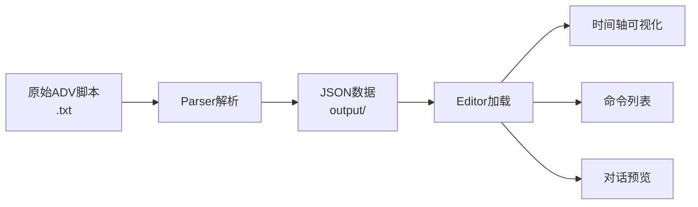

# Gakumas ADV Tools

学園アイドルマスター (Gakumas) ADV脚本工具集 - 解析、编辑、可视化一体化解决方案

## 📁 项目结构

```
gakumas-adv-tools/
├── parser/                         # Python脚本解析器
│   ├── parser.py                  # 单文件解析
│   ├── batch_parser.py            # 批量解析
│   └── requirements.txt
│
├── editor/                         # Web可视化编辑器
│   ├── src/
│   │   ├── types/                 # TypeScript类型定义
│   │   ├── utils/                 # 工具函数
│   │   └── components/            # React组件
│   ├── package.json
│   └── vite.config.ts
│
├── database/                       # 资源数据库系统 ⭐
│   ├── character_resources.db     # SQLite数据库
│   ├── update_resource_database.py # 初始化/导入工具
│   ├── resource_crud.py           # CRUD操作工具
│   ├── resource_api_server.py     # Flask API服务器
│   ├── resource_selector_demo.html # 前端演示
│   ├── 列表.txt                    # 游戏资源列表
│   └── README.md                  # 数据库文档
│
├── output/                         # 解析输出目录
│   └── *.json                     # 解析后的JSON文件 (2890+)
│
├── gakumas-data/                   # ADV脚本数据源 (Git Submodule)
│   └── data/                      # Gakumas-Auto-Translate 数据
│       └── *.txt                  # Unity ADV原始脚本 (2962个文件)
│
└── README.md                      # 本文件
```

## 🚀 快速开始

### 0. 资源数据库与API服务器（新增）

**为Web编辑器提供资源选择的后端数据库**

#### 初始化数据库

```bash
cd database

# 1. 初始化数据库表结构
python update_resource_database.py --init

# 2. 设置游戏解包目录（只需设置一次）
python update_resource_database.py --set-game-dir "D:\GIT\Gakuen-idolmaster-ab-decrypt\output"

# 3. 导入资源（自动从配置的目录扫描）
python update_resource_database.py --update

# 4. 查看数据库统计
python update_resource_database.py --stats
```

#### 启动API服务器

```bash
cd database

# 启动资源API服务器（为Web编辑器提供资源选择接口）
python resource_api_server.py
```

**API服务器运行在 `http://localhost:5000`**

#### 测试资源选择器

在浏览器中打开 [database/resource_selector_demo.html](./database/resource_selector_demo.html) 查看演示。

**可用API接口：**
- `GET /api/resources/models` - 获取模型列表（body/face/hair）
- `GET /api/resources/motions` - 获取动作列表（actormotion/facial）
- `GET /api/resources/environments` - 获取场景列表（2D/3D backgrounds）
- `GET /api/resources/audio` - 获取音频列表（voice/bgm/se）
- `GET /api/characters` - 获取所有角色
- `GET /api/search?q=关键词` - 搜索资源
cd database

# 查询角色amao的所有动作
python resource_crud.py --query-motion --character amao

# 搜索包含"night"的场景
python resource_crud.py --search night

# 查询所有2D场景
python resource_crud.py --query-env --type 2d
```

详细使用说明请参考 [database/README.md](./database/README
python resource_crud.py --query-env --type 2d
```

详细使用说明请参考 [DATABASE_USAGE.md](./DATABASE_USAGE.md) 和 [DATABASE_QUICKREF.md](./DATABASE_QUICKREF.md)

### 1. 启动Web编辑器

```bash
cd editor

# 首次运行：安装依赖
npm install

# 启动开发服务器
npm run dev
```

访问 http://localhost:5173 打开编辑器。
Resource Database (资源数据库)

- 🗄️ **SQLite存储**: 2D/3D场景、动作、模型、音频分类管理
- 🔍 **智能解析**: 自动识别资源类型（env_2d/env_3d/mot_/mdl_等）
- 🔗 **文件映射**: 关联列表.txt与游戏解包文件路径
- ✨ **CRUD操作**: 完整的增删查改命令行工具
- 🎯 **角色关联**: 快速查询角色的所有资源
- 📊 **统计分析**: 资源数量、类型分布统计

**数据库表结构：**
- `environments`: 2D/3D环境场景（地点、时间）
- `motions`: 角色/通用动作（idle、walk、facial等）
- `models`: 角色模型（body、face、hair）
- `audio_files`: 语音、BGM、音效
- `file_mappings`: 资源名 → 实际文件路径映射

### 
### 2. 加载并编辑脚本

**🎉 现在支持直接加载TXT文件！**

1. 在Web编辑器中点击"📁 加载脚本"
2. 选择 `gakumas-data/data/` 目录下的任意 `.txt` 文件（**无需预先转换**）
3. 或者选择 `output/` 目录下的 `.json` 文件
4. 使用时间轴编辑器查看和编辑脚本

**支持的文件格式：**
- `.txt` - Unity ADV原始脚本文件（**推荐**，直接加载）
- `.json` - 解析后的JSON文件（兼容旧格式）

### 3. (可选) 使用Python解析器批量转换

如果需要批量转换TXT到JSON：

```bash
cd parser

# 单文件解析
python parser.py <输入文件.txt>

# 批量解析 (解析所有ADV脚本)
python batch_parser.py
```

解析后的JSON文件会保存到 `output/` 目录。

## 📦 功能特性

### Parser (Python解析器)

- ✅ 支持25+种Unity ADV命令类型
- ✅ 处理嵌套JSON结构 (brackets, arrays)
- ✅ 正确解析转义字符 (`\{`, `\}`, `\"`)
- ✅ 多线程批量处理 (8并发)
- ✅ 进度条显示 (tqdm)
- ✅ 错误处理和日志记录

**解析格式示例：**
```
[message clip=\{...\}] 文本内容
[voiDatabase
- **SQLite3** - 轻量级关系数据库
- **Python 3.12+** - 数据库操作脚本

### ce name=vo_123 clip=\{...\}]
[camerasetting setting=\{...\}]
```

### Editor (Web编辑器)

- 🎬 **5轨道时间轴**：对话、语音、镜头、角色、特效
- 💬 **对话预览**：实时显示with Ruby注音
### ADV脚本编辑流程


### 资源数据库流程
```mermaid
graph LR
    A[列表.txt<br>资源名称] --> B[update_resource_database.py<br>导入分类]
    B --> C[SQLite数据库<br>character_resources.db]
    D[游戏解包文件<br>D:\GIT\Gakuen-idolmaster-ab-decrypt\output] --> E[scan_game_files<br>建立文件映射]
    E --> C
    C --> F[resource_crud.py<br>查询/增删改]
    F --> G[资源管理<br>场景/动作/模型/音频
### Parser
- **Python 3.12+**
- **tqdm** - 进度条显示

### Editor
- **React 18** - UI框架
- **TypeScript 5.3** - 类型系统
- **Vite 5** - 构建工具
- **CSS3** - 样式系统

## 📖 使用流程

```mermaid
graph LR
    A[原始ADV脚本<br>.txt] --> B[Parser解析]
    B --> C[JSON数据<br>output/]
    C --> D[Editor加载]
    D --> E[时间轴可视化]
    D --> F[命令列表]
    D --> G[对话预览]
```

## 📝 命令类型支持

### 对话系统
- `message` - 对话文本
- `selection` - 选择分支
- `chaptertitle` - 章节标题

### 语音控制
- `voice` - 语音播放
- `voicestop` - 停止语音

### 镜头控制
- `camerasetting` - 镜头设置
- `camerashake` - 镜头震动
- `cameradelay` - 镜头延迟

### 角色系统
- `actorgroup` - 角色组
- `actormotion` - 角色动作
- `actorfacialmotion` - 面部表情
- `actorfacialoverridemotion` - 面部覆盖

### 场景效果
- `backgroundgroup` - 背景组
- `background` - 背景设置
- `fade` - 渐变效果
- `transition` - 场景过渡
- `shake` - 震动效果

### 音频控制
- `bgmplay` / `bgmstop` - BGM控制
- `seplay` - 音效播放
- `envseplay` / `envsestop` - 环境音效

### Database 数据库操作
```bash
cd database

# 初始化数据库
python update_resource_database.py --init

# 配置游戏目录
python update_resource_database.py --set-game-dir "D:\path\to\game\output"

# 导入资源
python update_resource_database.py --update

# 查询操作
python resource_crud.py --query-motion --character amao
python resource_crud.py --search "keyword"

# 添加资源
python resource_crud.py --add-motion "mot_name" "character" --character amao

# 更新资源
python resource_crud.py --update-motion 123 --set-field action_type "dance"

# 删除资源
python resource_crud.py --delete-motion 123
```

### 特殊控制
- `wait` - 等待
- `waitvoice` - 等待语音结束
- `autoflag` - 自动播放标记

...等共25+种命令类型

## 🗂️ 输出目录说明

`output/` 目录包含2890+个解析后的JSON文件，命名格式：
- 原始文件：`adv_cidol-amao-3-000_01.txt`
- 解析输出：`adv_cidol-amao-3-000_01.json`

每个JSON文件包含：
```json
{
  "sourceFile": "原始文件路径",
  "totalCommands": 124,
  "duration": 104.33,
  "commands": [
    {
      "type": "message",
      "params": {...},
### ADV脚本流程
1. **原始脚本** (`d:\Games\gakumas\resource\adv\`) 
   ↓
2. **Parser解析** (`parser/parser.py`)
   ↓
3. **JSON输出** (`output/*.json`)
   ↓
4. **Editor加载** (Web界面)
   ↓
5. **可视化编辑** (时间轴/命令列表/预览)

### 资源数据库流程
1. **游戏解包** (`D:\GIT\Gakuen-idolmaster-ab-decrypt\output`)
   ↓
2. **资源列表** (`列表.txt` - 筛选后的资源名)
   ↓
3. **数据库导入** (`update_resource_database.py --import-list`)
   ↓
4. **文件映射** (`--scan-files` 建立名称→路径关联)
   ↓
5. **CRUD操作** (`resource_crud.py` 查询/管理资源
```bash
cd parser

# 单文件测试
python parser.py test.txt

# 批量处理
python batch_parser.py

# 调试模式 (带详细日志)
python parser.py test.txt --debug
```

### Editor
```bash
cd editor

# 开发模式 (热更新)
npm run dev

- [资源数据库使用指南](./DATABASE_USAGE.md) ⭐新增
- [资源数据库更新工具](./update_resource_database.py)
- [资源CRUD操作工具](./resource_crud.py)

---

**最后更新**: 2025-12-30  
**总解析文件数**: 2890  
**支持命令类型**: 25+  
**数据库资源分类**: 2D场景/3D场景/动作/模型/音频
# 预览生产构建
npm run preview
```

## 📂 数据流

1. **原始脚本** (`d:\Games\gakumas\resource\adv\`) 
   ↓
2. **Parser解析** (`parser/parser.py`)
   ↓
3. **JSON输出** (`output/*.json`)
   ↓
4. **Editor加载** (Web界面)
   ↓
5. **可视化编辑** (时间轴/命令列表/预览)

## ⚠️ 注意事项

1. **文件编码**：所有脚本文件使用UTF-8编码
2. **JSON转义**：`\{` `\}` 会被解析为 `{` `}`，`\"` 保留
3. **时间单位**：所有时间以秒为单位 (ClipData.startTime)
4. **并发数**：batch_parser默认8线程，可根据CPU调整
5. **浏览器兼容**：推荐Chrome/Edge 90+, Firefox 88+

## 🐛 常见问题

**Q: Parser报错 "找不到文件"**  
A: 检查 `batch_parser.py` 中的 `INPUT_DIR` 路径配置

**Q: Editor加载JSON后显示空白**  
A: 检查JSON文件格式，确保包含 `commands` 数组

**Q: 时间轴显示异常**  
A: 确认 ClipData 包含 `startTime` 和 `duration` 字段

**Q: Ruby注音不显示**  
A: 检查 message 内容中的 `<r\=...>` 标签格式

## 📄 许可证

MIT License

## 🔗 相关链接

### 核心文档
- [Unity ADV Script格式文档](./parser/FORMAT.md) (待创建)
- [TypeScript类型定义](./editor/src/types/adv-script.ts)
- [解析器实现细节](./parser/parser.py)

### 数据库相关 ⭐新增
- **� [数据库系统目录](./database/)** - 完整的资源数据库系统

- **🔌 [API接口文档](./database/API_REFERENCE.md)** - API服务器文档
- [资源选择器演示](./database/resource_selector_demo.html) - 前端集成示例

---

**最后更新**: 2025-12-30  
**总解析文件数**: 2890  
**支持命令类型**: 25+  
**数据库资源**: 环境场景353 | 动作1011 | 模型812 | 音频5  
**API服务器**: ✅ http://localhost:5000
